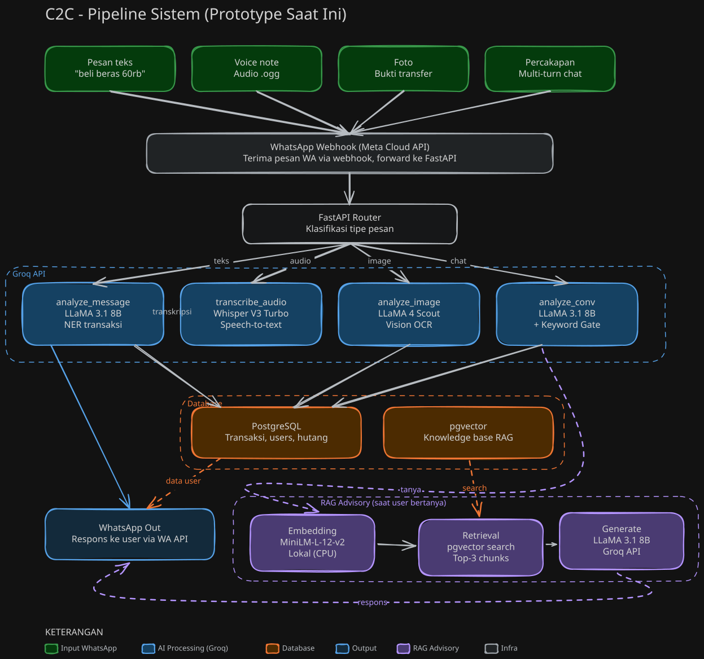
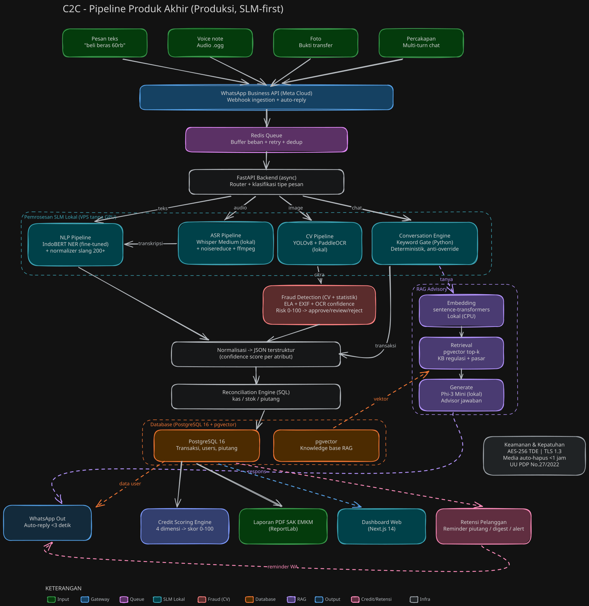

# C2C — Chat to Core

Pencatatan keuangan UMKM otomatis lewat WhatsApp. Kirim pesan teks, voice note, atau foto bukti transfer, sistem langsung mencatat transaksi dan menyusun laporan keuangan. Tidak perlu aplikasi baru, tidak ada kurva belajar.

**AI engine (prototype):** Groq API — `llama-3.1-8b-instant` (NER teks) + `whisper-large-v3-turbo` (ASR) + `llama-4-scout-17b-16e-instruct` (vision OCR).

## Arsitektur

### Prototype (yang berjalan sekarang)



### Produk Akhir 



Prototype memakai stack ringan (FastAPI + SQLite + Groq API) untuk demo cepat. Produk akhir bergeser ke SLM lokal (IndoBERT, Whisper Medium, YOLOv8 + PaddleOCR, Phi-3 Mini) di atas PostgreSQL + pgvector dengan Redis Queue dan deteksi fraud.

## Quick Start

```bash
python -m venv .venv
.venv\Scripts\activate              # Windows
pip install -r requirements.txt
cp .env.example .env                # isi GROQ_API_KEY
uvicorn app.main:app --reload
```

Dashboard: http://localhost:8000/dashboard

## Mendapatkan Groq API Key

1. Buka https://console.groq.com/keys
2. Login atau buat akun
3. Buat API key baru
4. Salin ke `.env` sebagai `GROQ_API_KEY=...`

Tier gratis: 14.400 request/hari. Kalau key expired, buat baru lalu update `.env`.

## Environment Variables

| Variable | Keterangan |
|----------|------------|
| `GROQ_API_KEY` | Groq API key (wajib) |
| `VERIFY_TOKEN` | String bebas untuk verifikasi webhook Meta (default `c2c_verify`) |
| `WHATSAPP_TOKEN` | Meta Graph API token (hanya untuk download audio WhatsApp asli) |
| `DB_DIR` | Override lokasi folder SQLite (mis. `/tmp` di lingkungan read-only) |

## Endpoints

| Method | Path | Keterangan |
|--------|------|------------|
| GET | `/` | Health check |
| GET | `/dashboard` | UI demo interaktif |
| GET | `/webhook` | Verifikasi webhook Meta |
| POST | `/webhook` | Handler pesan WhatsApp masuk (text/audio/image) |
| POST | `/send` | Input teks langsung |
| POST | `/send-audio` | Upload audio base64 → Whisper → NER |
| POST | `/send-image` | Upload gambar base64 → OCR bukti transfer |
| POST | `/conversation` | Simulator chat dua-arah (deteksi transaksi pasif dari percakapan) |
| GET | `/transactions/{phone}` | Riwayat transaksi (JSON) |
| GET | `/report/{phone}` | Download laporan PDF (format SAK EMKM) |

## Cara kerja input

- **Teks**: Bahasa Indonesia informal. Parsing nominal otomatis (`20rb` → 20000, `1.5jt` → 1500000). Intent diklasifikasi income / expense / unknown.
- **Voice note**: ditranskrip Whisper, lalu hasilnya masuk pipeline NER yang sama.
- **Foto bukti transfer**: OCR struk m-banking (BCA, Mandiri, BRI, GoPay, OVO, DANA, dll). Hanya transfer berstatus sukses yang dicatat.
- **Percakapan** (`/conversation`): mendeteksi transaksi dari chat natural penjual–pembeli. Ada keyword gate di sisi server: transaksi hanya dicatat kalau pesan terakhir memuat konfirmasi pembayaran eksplisit (transfer/bayar/lunas/cair/masuk). Intent model tidak bisa menembus gate ini.

## Testing

```bash
pip install -r requirements-dev.txt
pytest                              # 25 test (mock Groq, tanpa jaringan)
RUN_LIVE=1 pytest                   # + 1 live smoke test ke Groq (butuh key valid)
```

Cakupan: semua endpoint, operasi DB, dan keyword gate `/conversation`.

## Webhook WhatsApp asli (ngrok)

```bash
ngrok http 8000
# Salin URL HTTPS ke Meta App Dashboard sebagai webhook URL, path /webhook
# Pakai VERIFY_TOKEN yang sama di .env dan Meta dashboard
```

## Contoh curl

Verifikasi webhook:
```bash
curl "http://localhost:8000/webhook?hub.mode=subscribe&hub.verify_token=c2c_verify&hub.challenge=12345"
```

Kirim pesan teks:
```bash
curl -X POST http://localhost:8000/send \
  -H "Content-Type: application/json" \
  -d '{"phone_number": "628123456789", "message": "habis 20rb buat makan siang"}'
```

Upload bukti transfer:
```bash
B64=$(base64 -w 0 bukti_transfer.jpg)
curl -X POST http://localhost:8000/send-image \
  -H "Content-Type: application/json" \
  -d "{\"phone_number\": \"628123456789\", \"image_b64\": \"$B64\", \"mime_type\": \"image/jpeg\"}"
```

Simulasi payload WhatsApp masuk:
```bash
curl -X POST http://localhost:8000/webhook \
  -H "Content-Type: application/json" \
  -d '{
    "entry": [{
      "changes": [{
        "value": {
          "messages": [{
            "from": "628123456789",
            "type": "text",
            "text": { "body": "terima transfer 500 ribu dari Budi buat pesanan kue" }
          }]
        }
      }]
    }]
  }'
```

Download laporan PDF:
```bash
curl http://localhost:8000/report/628123456789 -o report.pdf
```

## Cek database

```bash
sqlite3 app.db "SELECT * FROM transactions;"
```

## Stack

FastAPI · SQLite · Groq API · ReportLab (PDF) · vanilla HTML/JS dashboard · Docker (HuggingFace Spaces, port 7860).
